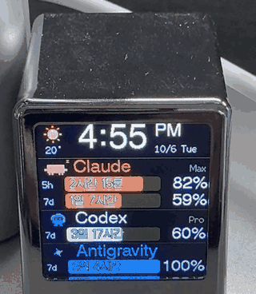
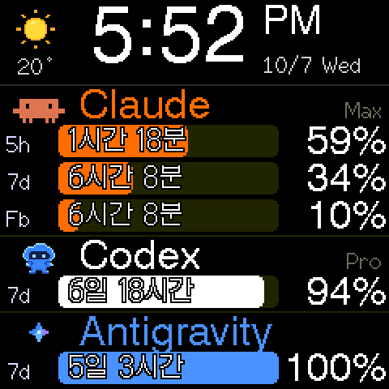

[English](README.md) | **한국어**

# SmallTV AI 사용량 표시기

[**GeekMagic SmallTV**](https://github.com/GeekMagicClock/smalltv)(ESP8266, 240×240 화면)를 AI 코딩 도구의 사용량 표시기로 바꾸는 커스텀
펌웨어입니다. **Claude Code, Codex, Antigravity**의 한도가 얼마나 남았는지, 다음 리셋까지 남은 시간,
시계와 날씨를 작은 캐릭터 애니메이션과 함께 보여줍니다.

 


```
┌──────────────────────────┐
│ *  19°   3:31 PM         │
│          10/6 Tue        │
├──────────────────────────┤
│ [Clawd] Claude       Max │
│ 5h [████████ 2h 5m ] 92% │
│ 7d [█████    4d 3h ] 62% │
│ Fb [███      4d 3h ] 35% │
├──────────────────────────┤
│ [robot] Codex        Pro │
│ 7d [████████ 3d 8h ] 71% │
├──────────────────────────┤
│ [star]  Antigravity      │
│ 7d [██████████  7d ]100% │
└──────────────────────────┘
```

- 맨 위: 날씨와 12시간제 시계. Mac의 인터넷이 끊기면 **Login required**를 표시합니다.
- 서비스마다 한 칸씩, 서비스 고유 색과 움직이는 캐릭터로 보여줍니다. Claude Max 요금제에서는 세 번째 줄
  `Fb`에 Fable 주간 한도를 보여줍니다(시계 크기를 지키려고 줄 높이를 조금씩 줄입니다).
- 막대와 %는 **남은 양**입니다. 오래된 값은 회색으로 바뀌고 얼마나 지났는지 표시합니다. 리셋된 창은
  새 값을 받을 때까지 100%로 표시합니다.
- 리셋까지 남은 시간과 접속 페이지는 19개 언어를 지원합니다: 한국어, 영어, 일본어, 중국어(간체/번체),
  스페인어, 포르투갈어, 프랑스어, 독일어, 이탈리아어, 러시아어, 우크라이나어, 폴란드어, 네덜란드어,
  터키어, 베트남어, 인도네시아어, 태국어, 아랍어. 아랍어는 화면에서 영어 단위를 씁니다.
- 날씨 지역은 기기의 접속 페이지에서 검색해서 정하고, 시계는 그 지역 시간대를 따릅니다.
- 관리자 암호는 선택 사항입니다. 아이디 없이 암호만 쓰고, 설정과 펌웨어 업데이트를 보호합니다.

> GeekMagic, Anthropic, OpenAI, Google과 관련이 없는 개인 프로젝트입니다. 제품 이름은 각 소유자의
> 것이고, 픽셀 캐릭터는 팬아트입니다.

## 동작 방식

```
Mac (always on)                       SmallTV (ESP8266)
tools/push_usage.py, launchd, 60 s    firmware/usagebar

  claude -p /usage        ─┐
  codex token → usage API  ├─ POST /api/usage ──▶  draws the screen
  agy -p /usage           ─┤
  Open-Meteo weather      ─┘ ◀── weather place ──  web page, /api/settings
```

기기는 로그인 토큰을 전혀 갖고 있지 않습니다. Mac이 공식 CLI를 통해 사용량을 읽고, 로그인은 각 CLI가
직접 관리합니다. 서비스마다 5분에 한 번, 그리고 한도가 리셋되면 1분 뒤에 한 번 더
조회합니다. 결과는 1분마다 기기로 보냅니다. Mac의 인터넷이 끊기면(로그인이 필요한 회사망에서 로그인 시간이
만료된 경우 등) 기기에 **Login required**가 뜹니다. 인터넷 확인에는 Apple의 접속 확인 주소와 HTTPS 요청을
함께 씁니다. 회사망 포털 중에는 Apple 확인 주소는 통과시키고 HTTPS만 막는 경우가 있기 때문입니다. 인터넷이
끊긴 동안 수집기는 조회를 멈추고 CLI도 실행하지 않아서, 로그인 브라우저 창이 쌓이지 않습니다.

## 하드웨어와 한계

ESP8266 80MHz, 여유 메모리 약 40KB, 플래시 4MB(Puya), SPI 연결 ST7789 240×240 화면입니다. **버튼이
없고**, **USB는 전원 전용**입니다(시리얼 변환 칩 없음). 순정 패널은 전용 초기화 순서가 필요합니다.
TFT_eSPI의 기본 초기화로는 화면이 까맣게 나옵니다. 핀 배치, 플래시 구조, 실측 성능, HTTPS 비용은
[docs/device-spec.md](docs/device-spec.md)를 참고하세요.

## 안전: 시리얼 어댑터 없이 펌웨어 올리기

이 기기는 무선(OTA)으로만 펌웨어를 올릴 수 있습니다. Wi‑Fi가 켜지기 전에 멈추는 펌웨어를 올리면
기기를 되살릴 수 없게 됩니다. 그래서 두 펌웨어 모두 다음을 지킵니다.

- 화면보다 **먼저** Wi‑Fi와 HTTP `/update` 페이지를 켭니다. Wi‑Fi에 연결할 수 없거나 아직 설정하지
  않았다면 자체 AP(192.168.4.1)를 엽니다.
- RTC 메모리에 크래시 기록을 남깁니다. 위험한 작업(화면 초기화, 그리기, 데이터 해석) 중에 재부팅되면,
  다음 부팅에서는 그 작업을 건너뜁니다.
- 순정과 같은 4M3M 플래시 구조를 쓰고, **LittleFS를 마운트·포맷·업로드하지 않습니다.** 그래서 순정
  데이터가 그대로 남고, 언제든 순정 펌웨어로 돌아갈 수 있습니다.
- 크기를 약 500KB보다 충분히 작게 유지해서, OTA로 올리고 내리는 게 양쪽 모두 가능합니다.

먼저 백업하세요. `safeboot`는 4MB 플래시 전체를 `/flash.bin`으로 내려줍니다.

## 저장소 구조

| 경로 | 내용 |
|---|---|
| `firmware/usagebar/` | 사용량 표시기 펌웨어 (PlatformIO) |
| `firmware/safeboot/` | 최소한의 진단·복구 펌웨어: Wi‑Fi, OTA, 플래시 전체 덤프, `/diag` 벤치마크 |
| `tools/push_usage.py` | 수집기 (파이썬 표준 라이브러리만 사용), launchd로 실행 |
| `tools/install_launchd.sh` | launchd 자동 실행 등록·해제 |
| `tools/gen_glyphs.py` | 언어별 남은 시간 글자를 `src/glyphs.h`로 생성 |
| `tools/gen_icons.py` | `tools/icons/*.json`으로 캐릭터 애니메이션과 날씨 아이콘을 `src/icons.h`로 생성 |
| `tools/probe.py` | `safeboot` 벤치마크를 모두 실행하고 결과 저장 |
| `docs/` | 기기 스펙 문서와 이미지 |
| `local/` | 커밋하지 않음: 플래시 덤프, 빌드 파일, 측정 결과, 외부 저장소 복제본 |

## 시작하기

### 어떤 파일을 올리나요?

| 파일 ([Releases](https://github.com/irsin78/geekmagictv/releases)에서 받기) | |
|---|---|
| `smalltv-usagebar-*.bin` | **사용량 표시기 펌웨어. 이것 하나만 있으면 됩니다.** 기기의 `/update` 페이지에서 올리세요. |
| `smalltv-safeboot-*.bin` | 선택 사항. 설치 전에 순정 펌웨어를 백업할 때(아래 2단계) 한 번 쓰거나, 나중에 복구할 때 쓰는 진단·복구 펌웨어입니다. |

배포 파일에는 비밀번호나 토큰이 들어 있지 않습니다.

### 방법 A: 배포 파일로 설치 (빌드 도구 불필요)

1. [Releases](https://github.com/irsin78/geekmagictv/releases)에서 `smalltv-usagebar-*.bin`을
   받습니다. 백업할 거라면 `smalltv-safeboot-*.bin`도 받으세요.
2. **순정 펌웨어 백업 (권장).** 순정 펌웨어의 `http://<기기 주소>/update` 페이지에서
   `smalltv-safeboot-*.bin`을 올립니다. 재시작되면 비밀번호 없는 Wi‑Fi **SmallTV-Safe**에 접속해서
   `http://192.168.4.1/flash.bin`(4MB 플래시 전체)을 받습니다. 그다음 `http://192.168.4.1/update`에서
   **Firmware 칸**으로 `smalltv-usagebar-*.bin`을 올립니다. FileSystem 칸은 절대 쓰지 마세요. 순정
   데이터가 지워집니다. 백업을 건너뛰려면 순정의 `/update` 페이지에서 `smalltv-usagebar-*.bin`을 바로
   올리면 됩니다.
3. **Wi‑Fi 설정.** 화면에 *Wi-Fi setup*이 나옵니다. 휴대폰이나 컴퓨터로 비밀번호 없는 Wi‑Fi
   **SmallTV-Setup**에 접속하면 설정 페이지가 자동으로 열립니다(안 열리면 `http://192.168.4.1`로
   접속). *주변 Wi‑Fi 찾기*를 누르고, 집 Wi‑Fi를 골라 비밀번호를 넣고 연결합니다. 기기가 재시작해서
   그 Wi‑Fi에 연결되고, 화면에 새 주소를 보여줍니다.
4. **접속 페이지.** `http://<기기 IP>/`에 접속해서 언어, 날씨 지역, 밝기를 정하고 **전송 토큰**을
   복사합니다.
5. **Mac에서:** CLI를 설치하고 로그인합니다([Claude Code](https://code.claude.com/docs/en/setup),
   [Codex](https://developers.openai.com/codex/cli),
   [Antigravity CLI](https://github.com/google-antigravity/antigravity-cli). `claude`, `codex`,
   `agy`를 한 번씩 실행해서 로그인). 이 저장소를 받은 뒤 수집기를 실행합니다.
   ```sh
   tools/install_launchd.sh <기기 IP> <전송 토큰>
   ```
   로그는 `~/Library/Logs/smalltv-usage.log`에 남습니다. 해제하려면
   `tools/install_launchd.sh --uninstall`을 실행하세요.

> 배포 파일의 Wi‑Fi 설정 과정(3단계)은 작성자가 실제 기기에서 테스트하지 못했습니다. 테스트 기기는
> Wi‑Fi 정보를 넣어 빌드한 펌웨어를 쓰고 있기 때문입니다. 그 이후 과정은 같은 코드입니다.

### 방법 B: 직접 빌드

1. `python3 -m venv .venv && .venv/bin/pip install -r tools/requirements.txt`
2. 선택 사항: `firmware/usagebar`와 `firmware/safeboot`에서 `include/secrets.h.example`을
   `include/secrets.h`로 복사하면 Wi‑Fi 정보를 펌웨어에 넣을 수 있습니다. `PUSH_TOKEN`도 넣으면
   `push_usage.py`가 `SMALLTV_TOKEN` 없이 그 값을 읽습니다. 이 파일이 없으면 배포 파일과 똑같이
   동작합니다(Wi‑Fi 설정 화면).
3. 각 펌웨어 폴더에서 `../../.venv/bin/pio run`으로 빌드합니다(비밀값 없는 파일은 `-e release`).
   `.pio/build/<env>/firmware.bin`을 `/update`에 올리고, 위의 4단계부터 진행합니다.

**순정 펌웨어로 되돌리기:** [GeekMagicClock/smalltv](https://github.com/GeekMagicClock/smalltv)의
공식 이미지(V3.1.4)를 `/update`에 올립니다. 지금 올라가 있는 이미지가 크면 더 작은 이미지(예:
`safeboot`)를 먼저 올려야 합니다. 크기 규칙은 [docs/device-spec.md](docs/device-spec.md)를 참고하세요.

## 기기 HTTP API (`usagebar`)

| 엔드포인트 | |
|---|---|
| `GET /` | 상태·설정 페이지 |
| `GET/POST /api/usage` | 현재 상태 조회 / 사용량 전송 (`Authorization: Bearer <전송 토큰>`) |
| `GET/POST /api/settings` | 밝기, 언어, 날씨 지역, 관리자 암호 (권한이 있으면 전송 토큰도 표시) |
| `GET /api/wifi/scan`, `POST /api/wifi` | Wi‑Fi 설정 |
| `POST /api/login`, `/api/logout` | 관리자 암호 로그인 (암호를 설정했을 때만) |
| `GET /api/info`, `/api/log` | 진단 정보 |
| `POST /api/reboot` | 재부팅 |
| `GET/POST /update` | 펌웨어 업로드. 파일시스템 업로드는 거부합니다. |

## 참고와 주의사항

- 사용량은 각 서비스의 내부 엔드포인트와 CLI 명령(CodexBar 같은 도구가 쓰는 것과 같은 방식)으로
  가져옵니다. 공개 문서가 있는 API가 아니라서 바뀔 수 있습니다.
- 사용량 엔드포인트에는 조회 제한이 있습니다(1분마다 조회하면 HTTP 429). 그래서 서비스마다 5분에 한 번
  (한도가 리셋되면 직후 한 번 더) 조회하고, 오류가 나면 간격을 늘립니다.
- 캐릭터와 날씨 픽셀 아트는 Codex CLI에게 요청해서 그렸습니다(`tools/icons/*.json`). Clawd는 Claude
  Code 시작 화면의 블록 문자를 바탕으로 했습니다.

## 출처

- [TFT_eSPI](https://github.com/Bodmer/TFT_eSPI), [ArduinoJson](https://arduinojson.org/),
  [ESP8266 Arduino core](https://github.com/esp8266/Arduino). `update_server.h`는 core의
  `ESP8266HTTPUpdateServer`(LGPL-2.1)를 바탕으로 했습니다.
- 폰트(SIL OFL 1.1): [갈무리](https://github.com/quiple/galmuri), [GNU Unifont](https://unifoundry.com/unifont/).
  `tools/fonts/` 참고.
- 날씨: [Open-Meteo](https://open-meteo.com/).
- 이 하드웨어에 대한 선행 작업: [ESPHome 기기 페이지](https://devices.esphome.io/devices/geekmagic-ultra/),
  [CodexBar](https://github.com/steipete/CodexBar).

## 라이선스

[MIT](LICENSE). 단, ESP8266 Arduino core를 바탕으로 한 `firmware/usagebar/src/update_server.h`는
LGPL-2.1을 따릅니다. 폰트는 SIL OFL 1.1을 따릅니다(`tools/fonts/` 참고).
